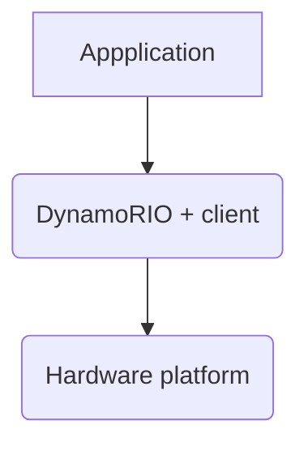

# dynamorio.exp

Repository containing code and documentation of my DynamoRIO framework experimentation.
## Direnv
- Make sure you have [direnv](https://direnv.net/)(version >= 2.25.2) installed.
- Make sure you have [cmake](https://cmake.org/)(version >= 3.22.1) installed.
- Set `DRIO_HOME` varible in [.envrc](./.envrc), pointing towards where DynamoRIO is located on the machine.
- Run `direnv allow`

## Build

```shell
$ build
``` 

## Run

```shell
$ run
```

## All-together now
```shell
$ direnv allow && build && run
```

# Context
## DynamoRIO

DynamoRIO is a runtime code manipulation system that supports code transformations on any part of a program, while the program is executed. DynamoRIO exports an interface for building dynamic tools for a wide variety of uses: program analysis and understanding, profiling, instrumentation, optimization, translation, etc. 
DynamoRIO operates in user mode on a target process. It acts as a process virtual machine, interposing between the application and the operating system. 
DynamoRIO has a complete view of the application code stream and acts as a runtime control point, allowing custom tools to be embedded inside it.

## DynamoRIO Clients
DynamoRIO client is a library that is coupled with DynamoRIO runtime to jointly operate on an input program binary.

DynamoRIO API provides events that a client can intercept, these event functions, if implemented by a client, are called by DynamoRIO at appropriate times.



# Tutorials

[IN PROGRESS] API Usage Tutorial - https://dynamorio.org/API_tutorial_bbdynsize1.html

# Running on Linux

There are two methods for invoking an application under DynamoRIO:

1. Configure and launch in one step via `drrun`
2. Configure via `drconfig` and launch via `drinject`

Example: command runs `ls` under DynamoRIO with the `bbsize sample client`:

```shell
$ drrun -c ${DRIO_HOME}/samples/bin64/libbbsize.so -- ls
```
> Use the tools in bin32/ for 32-bit applications and the tools in bin64/ for 64-bit applications.

## Application config

The `drconfig` tool writes an application configuration file. DynamoRIO reads configuration file at runtime. Once each process name is configured, the `drinject` tool can be used to invoke the parent process. The `drrun` tool can also be used but it creates a temporary configuration file that will override settings requested via `drconfig`. 

The configuration files are stored ${`DYNAMORIO_CONFIGDIR`}/.dynamorio/<APP_NAME>.config32 (or a config64 suffix for 64-bit). 
If `DYNAMORIO_CONFIGDIR` is not set, $`HOME`/.dynamorio/<APP_NAME>.config32 is used; if neither is set, a temp directory will be used when creating new configuration files for configure-and-run execution. On Android, if neither /data/local/tmp nor the current working directory are writable, you will need to specify a writable directory by setting the `DYNAMORIO_CONFIGDIR` environment variable.

There's also global configuration files in /etc/dynamorio/<APP_NAME>.config32 when a local configuration file is not found. `drconfig` does not support directly writing a global config file but such files can be copied from or modeled on local files.

## Running Scripts

When running scripts it is best to explicitly invoke the interpreter rather than invoking the script directly:

```shell
$ drrun -- /bin/bash myscript.sh
```

# Forum

[Google Groups](https://groups.google.com/g/dynamorio-users)

## Realted Google Groups Threads

- https://groups.google.com/g/dynamorio-users/c/ryuj9Eg1khE

- https://groups.google.com/g/dynamorio-users/c/Wqx9sKFOn2k

# Resources & Links
- [Debugging](https://dynamorio.org/page_debugging.html#autotoc_md138)

- [Samples](https://github.com/DynamoRIO/dynamorio/tree/master/api/samples)

- https://dynamorio.org

- https://dynamorio.org/overview.html

- https://css.csail.mit.edu/6.858/2010/labs/dr-docs/using.html#sec_build

- https://css.csail.mit.edu/6.858/2010/labs/dr-docs/API_samples.html

- https://www.burningcutlery.com/dynamorio/docs/

- [Submitted documentation link fix](https://github.com/DynamoRIO/dynamorio/pull/6034)

- [Building a Tool] (https://dynamorio.org/page_build_client.html)
