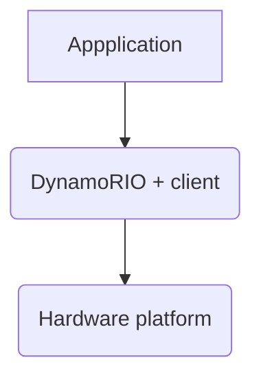

# DynamoRIO

DynamoRIO is a runtime code manipulation system that supports code transformations on any part of a program, while the program is executed. DynamoRIO exports an interface for building dynamic tools for a wide variety of uses: program analysis and understanding, profiling, instrumentation, optimization, translation, etc. 
DynamoRIO operates in user mode on a target process. It acts as a process virtual machine, interposing between the application and the operating system.
DynamoRIO has a complete view of the application code stream and acts as a runtime control point, allowing custom tools to be embedded inside it.

## DynamoRIO Clients
DynamoRIO client is a library that is coupled with DynamoRIO runtime to jointly operate on an input program binary.

DynamoRIO API provides events that a client can intercept, these event functions, if implemented by a client, are called by DynamoRIO at appropriate times.



### DynamoRIO Common Events

A client's primary interaction with the DynamoRIO runtime is through a set of callbacks:

- Basic block and trace creation or deletion

- Process initialization and exit

- Thread initialization and exit

- Fork child initialization (Linux-only); meant to be used for re-initialization of data structures and creation of new log files

- Application library load and unload

- Application fault or exception (signal on Linux)

- System call interception: pre-system call, post-system call, and system call filtering by number

- Signal interception (Linux-only)

- Nudges - DynamoRIO tries not to create permanent extra threads (see Thread Transparency), a nudge mechanism is preferred for pushing data into the process.

## DynamoRIO Clean Calls

[docs](https://dynamorio.org/API_BT.html)

DynamoRIO API provides a clean call mechanism, which allows insertion of a transparent call to a DynamoRIO client routine.
The [dr_insert_clean_call](https://dynamorio.org/dr__ir__utils_8h.html#a1df44dbe3d8dbf82e63e96741f167c64) routine takes care of switching to a clean stack, setting up arguments to a call and making the call, optionally preserving floating point state, and preserving application state across the entire sequence.

## DynamoRIO Meta Instructions

Changes to the instruction stream (`ilist`) made by a DynamoRIO client fall into two categories:
1. Changes or additions that should be considered part of the application's behavior,
2. Additions that are observational in nature and are not acting on the application's behalf - aka called meta instructions.

Meta-instructions:
[instr_set_meta()](https://dynamorio.org/dr__ir__instr_8h.html#a7bd1a4d1621b685541e8c28426a0cfe4)
[instrlist_meta_preinsert()](https://dynamorio.org/dr__ir__utils_8h.html#a4c8c687663c2f51e60e564ca9626acea)
[instrlist_meta_postinsert()](https://dynamorio.org/dr__ir__utils_8h.html#ad513dfc5199e89c7d22a271afa692b65)
[instrlist_meta_append()](https://dynamorio.org/dr__ir__utils_8h.html#a376024b7b2d33e3a86ec3544b80f645c)


Meta instructions are normally observational, in which case they should not fault and should have a NULL translation field. It is possible to use meta instructions that deliberately fault, or that could fault by accessing application memory addresses, but only if the client handles all such faults.

To traverse only application (NON-meta) instructions, a client can use the following API functions:

[instr_get_next_app()](https://dynamorio.org/dr__ir__instr_8h.html#a4582a4fd2729419bfc1d0c5dfeb86ab9)
[instrlist_first_app()](https://dynamorio.org/dr__ir__instrlist_8h.html#a623d9a44310e4d3373f266633ee07322)


### Arithmetic flags

[dr_restore_arith_flags()](https://dynamorio.org/dr__ir__utils_8h.html#a31b8fd731ecc840fcddda04c36a7eadd)
[dr_save_arith_flags()](https://dynamorio.org/dr__ir__utils_8h.html#abd9f556b8175c4ac72d8e7df8295f121)

Six flags in the flags register, are used to monitor the outcome of the arithmetic, logical, and related operations.
The six flags are the zero flag (ZF), carry flag (CF), overflow flag (OF), sign flag (SF), auxiliary flag (AF),
and parity flag (PF). These six flags are referred to as the status flags.

# Tutorials

[X] API Usage Tutorial - https://dynamorio.org/API_tutorial_bbdynsize1.html

[ ] Instruction Counting - https://css.csail.mit.edu/6.858/2010/labs/dr-docs/

# Running on Linux

There are two methods for invoking an application under DynamoRIO:

1. Configure and launch in one step via `drrun`
2. Configure via `drconfig` and launch via `drinject`

Example: command runs `ls` under DynamoRIO with the `bbsize sample client`:

```shell
$ drrun -c ${DRIO_HOME}/samples/bin64/libbbsize.so -- ls
```
> Use the tools in bin32/ for 32-bit applications and the tools in bin64/ for 64-bit applications.

## Application config

The `drconfig` tool writes an application configuration file. DynamoRIO reads configuration file at runtime. Once each process name is configured, the `drinject` tool can be used to invoke the parent process. The `drrun` tool can also be used but it creates a temporary configuration file that will override settings requested via `drconfig`.

The configuration files are stored ${`DYNAMORIO_CONFIGDIR`}/.dynamorio/<APP_NAME>.config32 (or a config64 suffix for 64-bit).

If `DYNAMORIO_CONFIGDIR` is not set, $`HOME`/.dynamorio/<APP_NAME>.config32 is used; if neither is set, a temp directory will be used when creating new configuration files for configure-and-run execution. On Android, if neither /data/local/tmp nor the current working directory are writable, you will need to specify a writable directory by setting the `DYNAMORIO_CONFIGDIR` environment variable.

There's also global configuratio         */
n files in /etc/dynamorio/<APP_NAME>.config32 when a local configuration file is not found. `drconfig` does not support directly writing a global config file but such files can be copied from or modeled on local files.

## Running Scripts

When running scripts it is best to explicitly invoke the interpreter rather than invoking the script directly:

```shell
$ drrun -- /bin/bash myscript.sh
```


# GDB

## Launching From GDB

[gdb local config](.gdbinit)

> To enable execution of this .gdbinit file add the follwoing line to global `~/.gdbinit` file: 

`add-auto-load-safe-path path/to/.gdbinit` 

[original docs](https://dynamorio.org/page_debugging.html#autotoc_md141)
```shell
gdb --args "${DRIO_HOME}/bin64/drrun" -c ./build/libhello_world_client.so -- ls
```
## Commands

### Registers
[docs](https://sourceware.org/gdb/onlinedocs/gdb/Registers.html)
```gdb
(gdb) info registers # list all registers, aka "i r"
(gdb) info registers rsp # shows one register
(gdb) layout regs # continue show registers, with TUI mode.```
```

## Obtaining callstack

```gdb
(gdb) start # Start the debugged program stopping at the beginning of the main procedure.
(gdb) catch signal SIGSEGV
(gdb) continue # continue on SIGILL
(gdb) info registers $rsp
rsp            0x7ffd00b71d78      0x7ffd00b71d78
(gdb) continue
(gdb) dps $rsp 0x7ffc6c49acf8
```

### Obtaining current stack pointer (SP) value:
```
(gdb) info registers $rsp # x86_64
rsp            0x7fffabf776a8      0x7fffabf776a8
(gdb) info registers $esp # x86
rsp            0x7fffffffc650      0x7fffffffc650
```

### Misc
```
(gdp) disassemble main # Dump of assembler code for function main
(gdp) delete breakpoints # Delete all breakpoints
```
# Forum

[Google Groups](https://groups.google.com/g/dynamorio-users)

## Realted Google Groups Threads

- [Optimizing increment operation sample - inc2add.c](https://groups.google.com/g/dynamorio-users/c/frdl1hvU-UI)

- [DynamoRIO runtime manipulation optimisation example](https://groups.google.com/g/dynamorio-users/c/JPyNQmLmL8g)

- [Clarifiaction about the use of dps function](https://groups.google.com/g/dynamorio-users/c/6OnuqQgAnZ4)

- [bbdynsize tutorial - build error](https://groups.google.com/g/dynamorio-users/c/BWVdySjLUn8)

- [Floating point exception when running bbdynsize tutorial](https://groups.google.com/g/dynamorio-users/c/q89Noup9Zn0)

- [Internal crash when running simple DynamoRIO client](https://groups.google.com/g/dynamorio-users/c/Wqx9sKFOn2k)

- [dynamorio tutorial - how to run the example](https://groups.google.com/g/dynamorio-users/c/ryuj9Eg1khE)

# Resources & Links

- [Debugging](https://dynamorio.org/page_debugging.html#autotoc_md138)

- [Samples](https://github.com/DynamoRIO/dynamorio/tree/master/api/samples)

- https://dynamorio.org

- https://dynamorio.org/overview.html

- https://css.csail.mit.edu/6.858/2010/labs/dr-docs/using.html#sec_build

- https://css.csail.mit.edu/6.858/2010/labs/dr-docs/API_samples.html

- https://www.burningcutlery.com/dynamorio/docs/

- [Submitted documentation link fix](https://github.com/DynamoRIO/dynamorio/pull/6034)

- [Building a Tool] (https://dynamorio.org/page_build_client.html)

- https://eli.thegreenplace.net/2011/09/06/stack-frame-layout-on-x86-64

- https://xl10.github.io/blog/drcctprof.html
